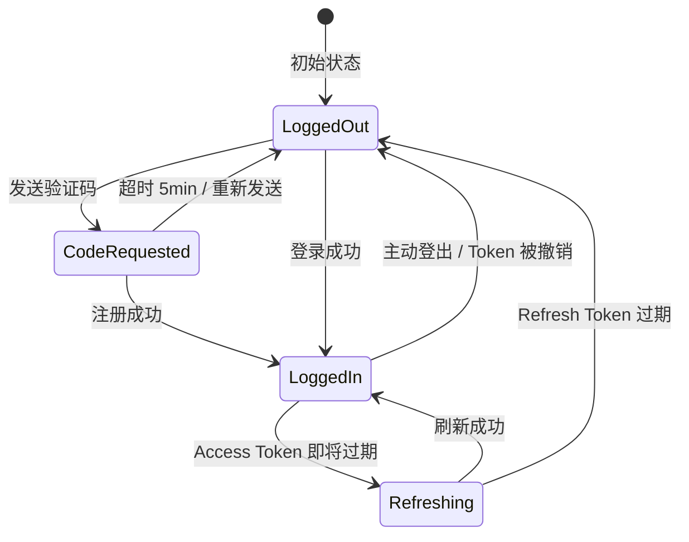
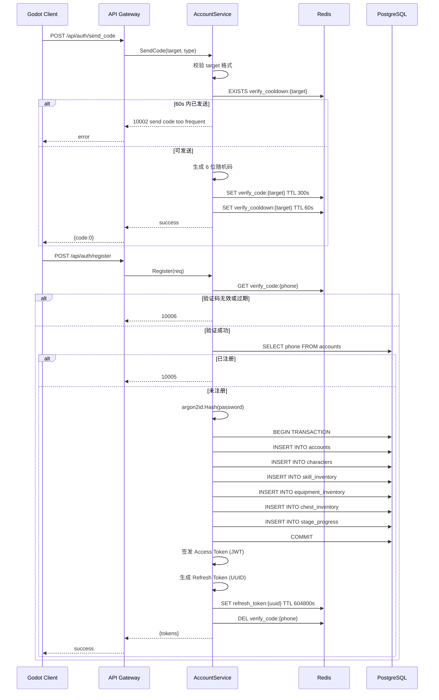
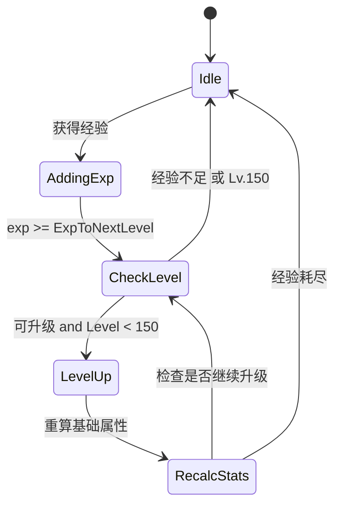
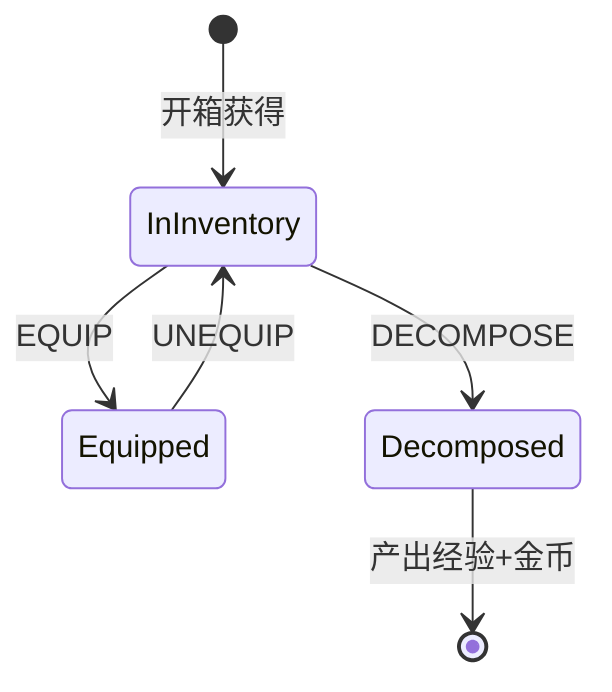
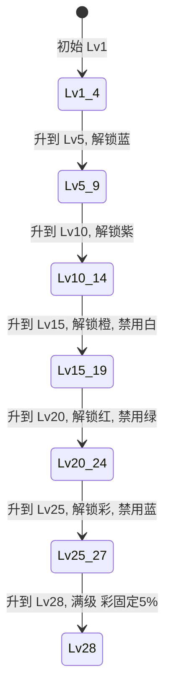
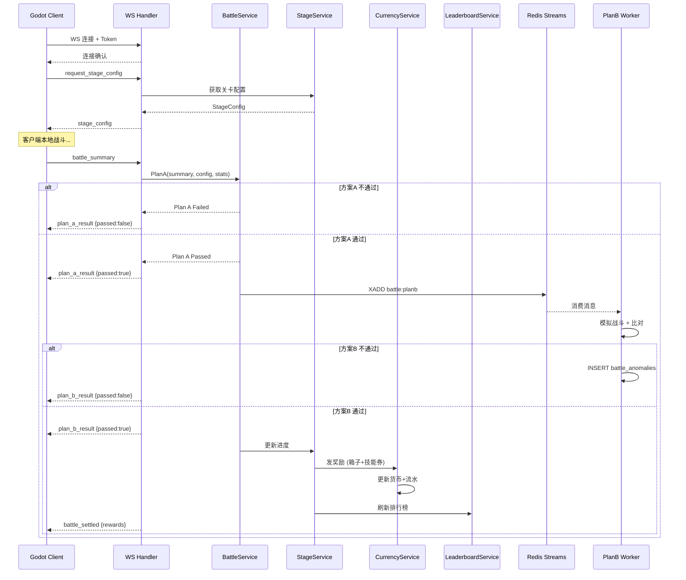
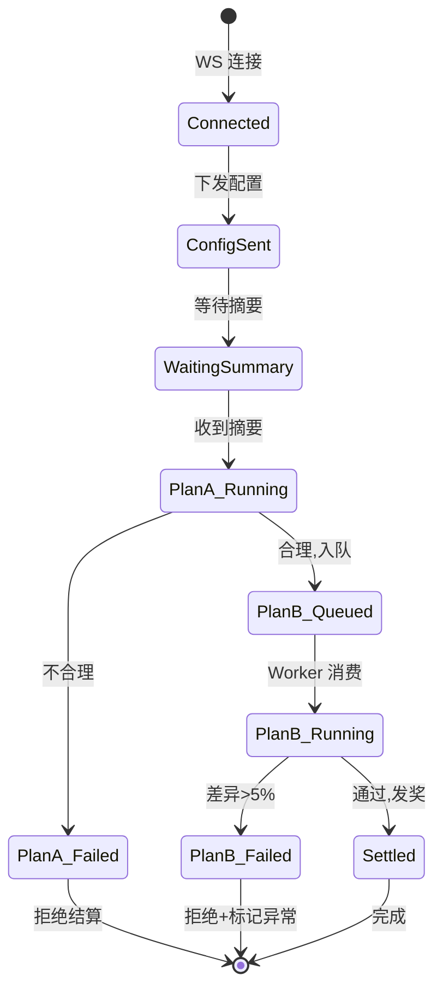
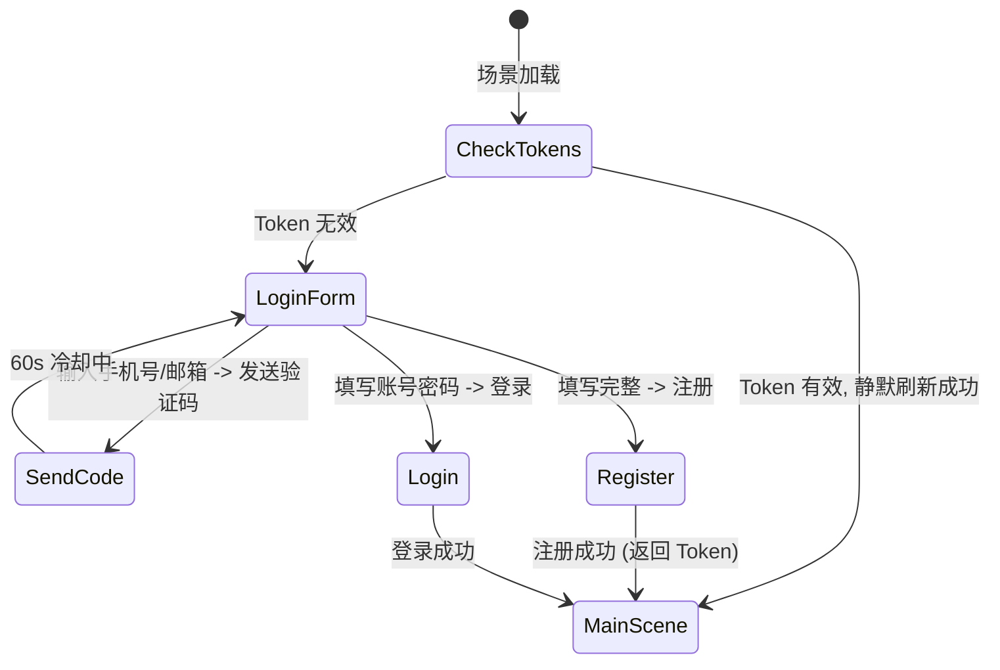
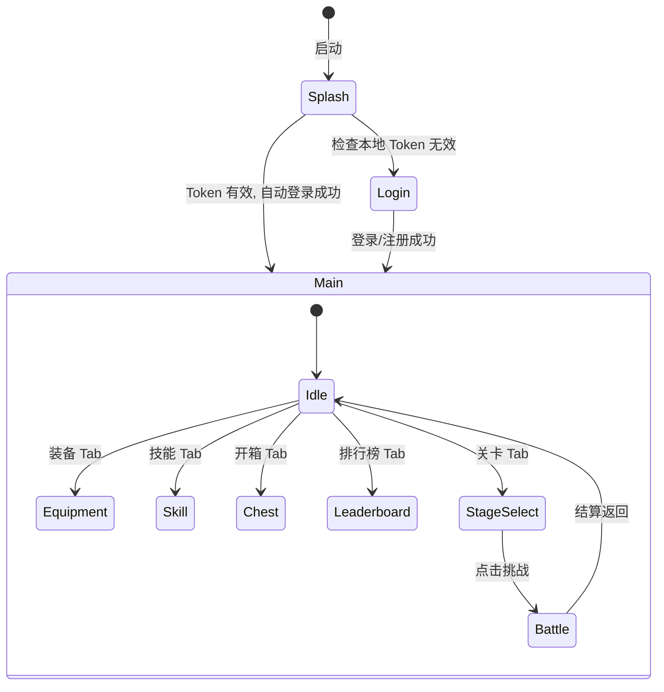

# 冒险大作战 - 详细设计文档

> 版本：v1.0 | 日期：2026-06-05 | 基于概要设计 v1.0

---

## 一、文档概述

### 1.1 文档目的

本文档是《冒险大作战》的详细设计文档，基于[概要设计文档](high-level-design.md)进行深化，定义每个模块的：

- 完整数据结构（Go struct / GDScript class）
- 完整 API 接口（请求/响应/错误码）
- 业务逻辑流程与算法
- 状态机与序列图
- 数据库完整 DDL 与 Redis 数据结构

### 1.2 适用范围

- 服务端：Go 1.26 + Gin + PostgreSQL + Redis
- 客户端：Godot Engine 4.x (Android 平台)
- 第一版范围：单职业（warrior）、4 个通用技能、PvE 关卡、单服分区排行榜

### 1.3 术语表

| 术语 | 说明 |
|------|------|
| Access Token | 短期 JWT，2 小时有效，用于业务请求鉴权 |
| Refresh Token | 长期 opaque token（UUID），7 天有效，Redis 存储，用于换取新 Access Token |
| 方案A | 战斗合理性即时校验（<100ms） |
| 方案B | 服务端异步重跑战斗模拟（1~3 秒） |
| 品质 | 装备/技能稀有度等级：白→绿→蓝→紫→橙→红→彩（7 级） |
| 商店等级 | 技能抽取商店等级（1~28），影响可抽取品质池 |
| 区域等级 | 开箱区域等级（1~28），影响开箱品质池 |
| 战力 / CP | Combat Power，角色综合战斗力数值 |

---

## 二、整体架构

### 2.1 部署架构

```
┌──────────────────────────────────────────────────┐
│                   Android 设备                    │
│              ┌───────────────────┐               │
│              │   Godot Client    │               │
│              │  (GDScript/C#)    │               │
│              └────────┬──────────┘               │
└───────────────────────┼──────────────────────────┘
                        │
          HTTP RESTful  │  WebSocket
        (业务接口)       │  (战斗上报)
                        │
        ┌───────────────┴────────────────┐
        │         Nginx / LB             │
        └───────────────┬────────────────┘
                        │
        ┌───────────────┴────────────────┐
        │          API Gateway           │
        │     (Gin + Middleware)         │
        │  路由 · JWT · 限流 · 日志 · CORS │
        └───────────────┬────────────────┘
                        │
    ┌──────┬──────┬─────┼─────┬──────┬──────┐
    ▼      ▼      ▼     │     ▼      ▼      ▼
┌──────┐┌──────┐┌──────┐│┌──────┐┌──────┐┌──────┐
│Account││Char ││Skill │││Equip ││Chest ││Stage │
│Module ││Module││Module│││Module││Module││Module│
└──┬───┘└──┬───┘└──┬───┘│└──┬───┘└──┬───┘└──┬───┘
   │       │       │     │   │       │       │
   └───────┴───────┴──┬──┴───┴───────┴───────┘
                      │
          ┌───────────┼───────────┐
          ▼           ▼           ▼
    ┌──────────┐┌──────────┐┌──────────┐
    │  Battle  ││Leaderboard││ Currency │
    │Verifier  ││  Module   ││  Module  │
    └────┬─────┘└──────────┘└──────────┘
         │
    ┌────┴────┐
    ▼         ▼
┌────────┐┌────────┐
│  Redis  ││  PG    │
│ Streams ││  DB    │
└────────┘└────────┘
```

### 2.2 技术栈明细

| 层级 | 技术 | 版本 | 用途 |
|------|------|------|------|
| 语言 | Go | 1.26 | 服务端主语言 |
| HTTP 框架 | Gin | v1.10+ | RESTful API |
| 数据库 | PostgreSQL | 16+ | 持久化存储 |
| 缓存/队列 | Redis | 7+ | Token 存储、排行榜、消息队列 |
| JWT | golang-jwt | v5 | Access Token 签发/验证 |
| 密码哈希 | argon2id | - | 密码安全存储 |
| 日志 | slog | stdlib | 结构化日志 |
| 配置 | Viper | v1.19+ | 配置管理 |
| 客户端引擎 | Godot | 4.3+ | 客户端渲染与逻辑 |
| 客户端语言 | GDScript | - | 客户端脚本 |
| 网络 | HTTPClient + WebSocketPeer | Godot 内置 | 客户端网络通信 |

---

## 三、项目结构

### 3.1 服务端目录结构（Go）

```
server/
├── cmd/
│   └── server/
│       └── main.go                  # 入口：加载配置、初始化 DB/Redis、启动 HTTP 服务
├── internal/
│   ├── config/
│   │   └── config.go                # 配置结构体 + 加载（Viper）
│   ├── gateway/
│   │   ├── router.go                # Gin 路由注册
│   │   └── middleware/
│   │       ├── auth.go              # JWT 鉴权中间件
│   │       ├── ratelimit.go         # 令牌桶限流中间件
│   │       ├── logger.go            # 请求日志中间件
│   │       └── recovery.go          # Panic 恢复中间件
│   ├── model/                       # 数据库模型（与表一一对应）
│   │   ├── account.go
│   │   ├── character.go
│   │   ├── skill.go
│   │   ├── equipment.go
│   │   ├── chest.go
│   │   ├── stage.go
│   │   └── currency.go
│   ├── repository/                  # 数据访问层（SQL/Redis 操作）
│   │   ├── account_repo.go
│   │   ├── character_repo.go
│   │   ├── skill_repo.go
│   │   ├── equipment_repo.go
│   │   ├── chest_repo.go
│   │   ├── stage_repo.go
│   │   ├── leaderboard_repo.go
│   │   └── currency_repo.go
│   ├── service/                     # 业务逻辑层
│   │   ├── account_svc.go
│   │   ├── character_svc.go
│   │   ├── skill_svc.go
│   │   ├── equipment_svc.go
│   │   ├── chest_svc.go
│   │   ├── battle_svc.go
│   │   ├── stage_svc.go
│   │   ├── leaderboard_svc.go
│   │   └── currency_svc.go
│   ├── handler/                     # HTTP/WS 处理器
│   │   ├── account_handler.go
│   │   ├── character_handler.go
│   │   ├── skill_handler.go
│   │   ├── equipment_handler.go
│   │   ├── chest_handler.go
│   │   ├── battle_ws_handler.go
│   │   ├── stage_handler.go
│   │   └── leaderboard_handler.go
│   └── worker/                      # 后台 Worker
│       └── battle_planb_worker.go   # 方案B 战斗重跑消费者
├── pkg/
│   ├── jwt/
│   │   └── jwt.go                   # JWT 签发/验证工具
│   ├── response/
│   │   └── response.go              # 统一响应格式
│   ├── errcode/
│   │   └── errcode.go               # 错误码定义
│   └── password/
│       └── argon2.go                # argon2id 哈希工具
├── migrations/
│   ├── 001_create_accounts.up.sql
│   └── ...
├── config/
│   └── config.yaml                  # 默认配置文件
├── go.mod
└── go.sum
```

### 3.2 客户端目录结构（Godot）

```
client/
├── scenes/
│   ├── login/
│   │   ├── login_scene.tscn
│   │   └── login_ui.gd
│   ├── main/
│   │   ├── main_scene.tscn
│   │   └── main_ui.gd
│   ├── battle/
│   │   ├── battle_scene.tscn
│   │   ├── battle_controller.gd
│   │   ├── battle_simulator.gd
│   │   └── battle_renderer.gd
│   ├── equipment/
│   │   ├── equipment_scene.tscn
│   │   └── equipment_ui.gd
│   ├── skill/
│   │   ├── skill_scene.tscn
│   │   ├── skill_ui.gd
│   │   └── gacha_ui.gd
│   ├── chest/
│   │   ├── chest_scene.tscn
│   │   └── chest_ui.gd
│   └── leaderboard/
│       ├── leaderboard_scene.tscn
│       └── leaderboard_ui.gd
├── scripts/
│   ├── autoload/
│   │   ├── network_manager.gd       # HTTP + WS 管理（单例）
│   │   ├── player_state.gd          # 玩家本地状态缓存（单例）
│   │   └── event_bus.gd             # 全局事件总线（单例）
│   ├── models/
│   │   ├── character_model.gd
│   │   ├── equipment_model.gd
│   │   ├── skill_model.gd
│   │   └── stage_model.gd
│   └── utils/
│       ├── http_client.gd
│       └── ws_client.gd
├── assets/
│   ├── sprites/
│   ├── sounds/
│   └── fonts/
└── project.godot
```

---

## 四、API Gateway 详细设计

### 4.1 中间件链

```
Request
  │
  ▼
┌─────────────┐
│  Recovery    │  ← Panic 恢复，返回 500
└──────┬──────┘
       ▼
┌─────────────┐
│   Logger     │  ← 记录 method、path、status、latency
└──────┬──────┘
       ▼
┌─────────────┐
│   CORS       │  ← 跨域配置
└──────┬──────┘
       ▼
┌─────────────┐
│  RateLimit   │  ← 令牌桶：全局 100 req/s，单 IP 20 req/s
└──────┬──────┘
       ▼
┌─────────────┐
│  JWT Auth    │  ← 验证 Access Token（白名单路径跳过）
└──────┬──────┘
       ▼
    Handler
```

### 4.2 JWT 鉴权中间件

**白名单路径**（跳过鉴权）：
- `POST /api/auth/register`
- `POST /api/auth/login`
- `POST /api/auth/send_code`
- `POST /api/auth/refresh`

**鉴权逻辑**：
```go
// 1. 从 Header 提取 Authorization: Bearer <token>
// 2. 解析 JWT，验证签名 + 过期时间
// 3. 提取 character_id 写入 gin.Context
// 4. 失败返回 401 Unauthorized
```

**JWT Payload 结构**：
```go
type Claims struct {
    jwt.RegisteredClaims
    AccountID   int64  `json:"aid"`
    CharacterID int64  `json:"cid"`
}
```

### 4.3 限流策略

| 限流维度 | 算法 | 速率 | 说明 |
|----------|------|------|------|
| 全局 | 令牌桶 | 1000 req/s | 服务整体保护 |
| 单 IP | 令牌桶 | 30 req/s | 防止单客户端滥用 |
| 登录接口 | 令牌桶 | 5 req/min/IP | 防暴力破解 |
| 抽取接口 | 令牌桶 | 10 req/s/IP | 防刷抽取 |

**实现**：基于 Redis 的滑动窗口 + 令牌桶，Key 格式 `ratelimit:{ip}:{path}`。

---

## 五、模块详细设计 —— 账号模块

### 5.1 模块职责

- 用户注册（手机号 / 邮箱）
- 用户登录（签发双 Token）
- Token 刷新
- 验证码发送与校验

### 5.2 数据结构

```go
// model/account.go
type Account struct {
    ID           int64     `json:"id"           db:"id"`
    Phone        string    `json:"phone"        db:"phone"`
    Email        string    `json:"email"        db:"email"`
    PasswordHash string    `json:"-"            db:"password_hash"`
    CreatedAt    time.Time `json:"created_at"   db:"created_at"`
}
```

**密码哈希**：argon2id，参数：
- Memory: 64 MiB
- Iterations: 3
- Parallelism: 4
- Salt length: 16 bytes
- Key length: 32 bytes

### 5.3 Redis 数据结构

#### Refresh Token

```
Key:   refresh_token:{uuid}
Value: {"account_id": 1, "character_id": 1}
TTL:   7 days (604800s)
```

#### 验证码

```
Key:   verify_code:{phone_or_email}
Value: {"code": "123456", "attempts": 0}
TTL:   5 min (300s)
```

#### 发送冷却

```
Key:   verify_cooldown:{phone_or_email}
Value: "1"
TTL:   60s
```

### 5.4 API 接口定义

#### 5.4.1 发送验证码

```
POST /api/auth/send_code
```

**请求体**：
```json
{
    "target": "13800138000",
    "type": "phone"
}
```

**响应**：
```json
{
    "code": 0,
    "msg": "ok",
    "data": {}
}
```

**错误码**：

| code | msg | 说明 |
|------|-----|------|
| 10001 | invalid target format | 手机号/邮箱格式错误 |
| 10002 | send code too frequent | 60 秒内重复发送 |

**业务规则**：
1. 同一 target 60 秒内仅允许发送 1 次
2. 验证码 6 位数字，5 分钟有效
3. 最多验证 5 次，超出需重新发送

#### 5.4.2 注册

```
POST /api/auth/register
```

**请求体**：
```json
{
    "phone": "13800138000",
    "email": "",
    "password": "Abc12345!",
    "code": "123456",
    "nickname": "冒险者张三"
}
```

**响应**：
```json
{
    "code": 0,
    "msg": "ok",
    "data": {
        "account_id": 1,
        "character_id": 1,
        "access_token": "eyJhbGci...",
        "refresh_token": "550e8400-e29b-41d4-a716-446655440000",
        "expires_in": 7200
    }
}
```

**错误码**：

| code | msg | 说明 |
|------|-----|------|
| 10003 | phone/email required | 手机号和邮箱至少提供一个 |
| 10004 | invalid password format | 密码不符合规则 |
| 10005 | phone/email already registered | 已注册 |
| 10006 | invalid or expired code | 验证码错误或过期 |
| 10007 | nickname too short/long | 昵称长度不符 |

**业务规则**：
1. phone 和 email 至少提供一个，可同时提供
2. 密码：8~32 字符，至少包含字母+数字
3. 注册时创建 Account + Character（初始属性）
4. 同时创建 skill_inventory、equipment_inventory、chest_inventory、stage_progress 记录
5. 注册成功自动登录（返回双 Token）
6. 使用数据库事务保证 6 张表的原子写入

#### 5.4.3 登录

```
POST /api/auth/login
```

**请求体**：
```json
{
    "account": "13800138000",
    "password": "Abc12345!"
}
```

**响应**：同注册响应。

**错误码**：

| code | msg | 说明 |
|------|-----|------|
| 10008 | account not found | 账号不存在 |
| 10009 | wrong password | 密码错误 |
| 10010 | login too frequent | 登录过于频繁（5 次/分钟） |

#### 5.4.4 刷新 Token

```
POST /api/auth/refresh
```

**请求体**：
```json
{
    "refresh_token": "550e8400-e29b-41d4-a716-446655440000"
}
```

**响应**：
```json
{
    "code": 0,
    "msg": "ok",
    "data": {
        "access_token": "eyJhbGci...",
        "refresh_token": "660e8400-e29b-41d4-a716-446655440001",
        "expires_in": 7200
    }
}
```

**错误码**：

| code | msg | 说明 |
|------|-----|------|
| 10011 | invalid refresh token | Token 无效 |
| 10012 | refresh token expired | Token 过期，需重新登录 |

**业务规则**：
1. 采用 **Refresh Token Rotation**：每次刷新同时下发新 Refresh Token，旧 Token 立即失效（DEL 旧 Key）
2. Access Token 有效期 2 小时，Refresh Token 7 天

### 5.5 状态机 —— 登录态



### 5.6 序列图 —— 注册流程



---

## 六、模块详细设计 —— 角色模块

### 6.1 模块职责

- 管理角色基础属性（等级、经验、atk/def/hp）
- 提供战力（CP）计算
- 处理经验增加与升级逻辑
- 最终属性合成（基础 + 装备 + 技能加成）

### 6.2 数据结构

```go
// model/character.go
type Character struct {
    ID           int64     `json:"id"            db:"id"`
    AccountID    int64     `json:"account_id"    db:"account_id"`
    Nickname     string    `json:"nickname"      db:"nickname"`
    Level        int       `json:"level"         db:"level"`
    Exp          int64     `json:"exp"           db:"exp"`
    BaseATK      int       `json:"base_atk"      db:"base_atk"`
    BaseDEF      int       `json:"base_def"      db:"base_def"`
    BaseHP       int       `json:"base_hp"       db:"base_hp"`
    Class        string    `json:"class"         db:"class"`
    Gold         int64     `json:"gold"          db:"gold"`
    SkillTickets int       `json:"skill_tickets" db:"skill_tickets"`
    CreatedAt    time.Time `json:"created_at"    db:"created_at"`
}

// FinalStats 最终属性 = 基础 + 装备 + 技能加成
type FinalStats struct {
    ATK       int     `json:"atk"`
    DEF       int     `json:"def"`
    HP        int     `json:"hp"`
    CritRate  float64 `json:"crit_rate"`
    CritDmg   float64 `json:"crit_dmg"`
    AtkSpeed  float64 `json:"atk_speed"`
    MoveSpeed float64 `json:"move_speed"`
    CP        int64   `json:"cp"`
}
```

### 6.3 属性成长公式

**基础属性成长（线性）**：

| 属性 | 1 级初始值 | 每级成长 | 公式 |
|------|-----------|----------|------|
| ATK | 10 | +3 | `base_atk(L) = 10 + 3 x (L - 1)` |
| DEF | 5 | +1.5 | `base_def(L) = 5 + floor(1.5 x (L - 1))` |
| HP | 100 | +20 | `base_hp(L) = 100 + 20 x (L - 1)` |

- 等级上限：**150**
- 里程碑等级：30、60、100（后续版本用于转职扩展）

**经验曲线（指数）**：

```
ExpToNextLevel(L) = floor(100 x 1.15^(L - 1))
```

| 等级 | 升级所需经验 | 累计经验 |
|------|-------------|----------|
| 1->2 | 100 | 100 |
| 2->3 | 115 | 215 |
| 5->6 | 175 | 650 |
| 10->11 | 352 | 2,325 |
| 50->51 | 86,848 | ~665,000 |
| 100->101 | 93,739,525 | ~720,000,000 |

### 6.4 战力计算公式

```
CP = ATK x 2 + DEF x 1.5 + HP x 0.5
   + CritRate x 100 x 10
   + (CritDmg - 1.5) x 100 x 5
   + (AtkSpeed - 1.0) x 100 x 10
```

其中基准值：CritRate=0.05、CritDmg=1.5、AtkSpeed=1.0。

**示例计算**（角色 Lv.10 + 装备）：
```
基础：ATK=37, DEF=18, HP=280
装备：ATK+20, DEF+10, HP+50, CritRate+5%, CritDmg+20%
最终：ATK=57, DEF=28, HP=330, CritRate=0.10, CritDmg=1.70, AtkSpeed=1.0
CP = 57x2 + 28x1.5 + 330x0.5 + 0.10x100x10 + (1.70-1.50)x100x5 + 0
   = 114 + 42 + 165 + 100 + 100 = 521
```

### 6.5 最终属性合成

```go
func (s *CharacterService) GetFinalStats(characterID int64) (*FinalStats, error) {
    char := s.charRepo.GetCharacter(characterID)
    equipStats := s.equipSvc.GetEquippedStats(characterID)
    skillStats := s.skillSvc.GetEquippedSkillBonuses(characterID)

    stats := &FinalStats{
        ATK: char.BaseATK + equipStats.ATK + skillStats.ATK,
        DEF: char.BaseDEF + equipStats.DEF + skillStats.DEF,
        HP:  char.BaseHP  + equipStats.HP  + skillStats.HP,
        CritRate:  0.05 + equipStats.CritRate + skillStats.CritRate,
        CritDmg:   1.50 + equipStats.CritDmg  + skillStats.CritDmg,
        AtkSpeed:  1.00 + equipStats.AtkSpeed + skillStats.AtkSpeed,
        MoveSpeed: 1.00 + equipStats.MoveSpeed + skillStats.MoveSpeed,
    }
    stats.CP = calcCP(stats)
    return stats, nil
}
```

### 6.6 API 接口定义

#### 6.6.1 获取角色信息

```
GET /api/character
```

**响应**：
```json
{
    "code": 0,
    "msg": "ok",
    "data": {
        "character": {
            "id": 1,
            "nickname": "冒险者张三",
            "level": 10,
            "exp": 1500,
            "exp_to_next": 352,
            "class": "warrior",
            "gold": 5000,
            "skill_tickets": 20
        },
        "stats": {
            "atk": 57,
            "def": 28,
            "hp": 330,
            "crit_rate": 0.10,
            "crit_dmg": 1.70,
            "atk_speed": 1.0,
            "move_speed": 1.0,
            "cp": 521
        }
    }
}
```

#### 6.6.2 增加经验（内部接口）

```
POST /api/character/add_exp
```

**说明**：由装备分解等模块内部调用，不直接暴露给客户端单次调用。

**请求体**：
```json
{ "exp": 350 }
```

**响应**：
```json
{
    "code": 0,
    "msg": "ok",
    "data": {
        "leveled_up": true,
        "new_level": 11,
        "stats_changed": {
            "base_atk": {"from": 37, "to": 40},
            "base_def": {"from": 18, "to": 20},
            "base_hp": {"from": 280, "to": 300}
        }
    }
}
```

**升级逻辑**：
```go
func (s *CharacterService) AddExp(characterID int64, exp int64) (*AddExpResult, error) {
    char := s.repo.GetCharacter(characterID)
    char.Exp += exp

    leveledUp := false
    for char.Level < 150 {
        needed := ExpToNextLevel(char.Level)
        if char.Exp < needed {
            break
        }
        char.Exp -= needed
        char.Level++
        char.BaseATK = 10 + 3*(char.Level-1)
        char.BaseDEF = 5 + int(math.Floor(1.5*float64(char.Level-1)))
        char.BaseHP  = 100 + 20*(char.Level-1)
        leveledUp = true
    }
    s.repo.UpdateCharacter(char)
    return &AddExpResult{LeveledUp: leveledUp, NewLevel: char.Level}, nil
}
```

### 6.7 状态机 —— 角色升级



---

## 七、模块详细设计 —— 装备模块

### 7.1 模块职责

- 装备仓库管理（存储、查询）
- 装备栏（10 槽位）的装备/卸下
- 装备分解（产出经验 + 金币）
- 最终属性合成（由角色模块调用）

### 7.2 数据结构

```go
// model/equipment.go

type EquipmentSlot string

const (
    SlotWeapon EquipmentSlot = "weapon"
    SlotHelmet EquipmentSlot = "helmet"
    SlotArmor  EquipmentSlot = "armor"
    SlotShoes  EquipmentSlot = "shoes"
    SlotRing1  EquipmentSlot = "ring1"
    SlotRing2  EquipmentSlot = "ring2"
    SlotNeck   EquipmentSlot = "necklace"
    SlotBracer EquipmentSlot = "bracer"
    SlotBelt   EquipmentSlot = "belt"
    SlotGloves EquipmentSlot = "gloves"
)

type EquipmentQuality int

const (
    QualityCommon    EquipmentQuality = 1  // 白
    QualityUncommon  EquipmentQuality = 2  // 绿
    QualityRare      EquipmentQuality = 3  // 蓝
    QualityEpic      EquipmentQuality = 4  // 紫
    QualityLegendary EquipmentQuality = 5  // 橙
    QualityMythic    EquipmentQuality = 6  // 红
    QualityDivine    EquipmentQuality = 7  // 彩
)

type Equipment struct {
    UID       string           `json:"uid"`
    Slot      EquipmentSlot    `json:"slot"`
    Quality   EquipmentQuality `json:"quality"`
    ATK       int              `json:"atk"`
    DEF       int              `json:"def"`
    HP        int              `json:"hp"`
    CritRate  float64          `json:"crit_rate,omitempty"`
    CritDmg   float64          `json:"crit_dmg,omitempty"`
    AtkSpeed  float64          `json:"atk_speed,omitempty"`
    MoveSpeed float64          `json:"move_speed,omitempty"`
}

type EquipmentInventory struct {
    ID          int64             `json:"id"`
    CharacterID int64             `json:"character_id"`
    Items       []Equipment       `json:"items"`
    Equipped    map[string]string `json:"equipped"` // slot -> uid
}
```

### 7.3 装备属性生成规则

**各部位属性类型**：

| 部位 | 主属性 | 副属性 |
|------|--------|--------|
| weapon | ATK | AtkSpeed, CritRate |
| helmet | HP, DEF | — |
| armor | HP, DEF | — |
| shoes | HP | MoveSpeed |
| ring1 | ATK | CritRate |
| ring2 | ATK | CritRate |
| necklace | HP | CritDmg |
| bracer | ATK, DEF | — |
| belt | HP, DEF | — |
| gloves | ATK | AtkSpeed, CritRate |

**各品质属性数值范围**：

| 品质 | ATK | DEF | HP | 副属性 |
|------|-----|-----|-----|--------|
| 白 Common | 5~15 | 3~8 | 20~50 | — |
| 绿 Uncommon | 16~30 | 9~18 | 51~100 | 1%~3% |
| 蓝 Rare | 31~55 | 19~35 | 101~180 | 3%~6% |
| 紫 Epic | 56~90 | 36~55 | 181~300 | 6%~10% |
| 橙 Legendary | 91~140 | 56~85 | 301~460 | 10%~15% |
| 红 Mythic | 141~210 | 86~130 | 461~680 | 15%~22% |
| 彩 Divine | 211~320 | 131~200 | 681~1000 | 22%~30% |

**生成算法**：
```go
func GenerateEquipment(slot EquipmentSlot, quality EquipmentQuality) Equipment {
    uid := uuid.New().String()
    e := Equipment{UID: uid, Slot: slot, Quality: quality}
    rng := rand.New(rand.NewSource(time.Now().UnixNano()))

    e.ATK = randRange(rng, atkRange[quality])
    e.DEF = randRange(rng, defRange[quality])
    e.HP  = randRange(rng, hpRange[quality])

    if quality >= QualityUncommon {
        for _, sec := range slotSecondaries[slot] {
            val := randRangeFloat(rng, secondaryRange[quality])
            applySecondary(&e, sec, val)
        }
    }
    return e
}
```

### 7.4 装备分解

| 品质 | 经验 | 金币 |
|------|------|------|
| 白 | 10 | 50 |
| 绿 | 25 | 120 |
| 蓝 | 60 | 300 |
| 紫 | 140 | 700 |
| 橙 | 350 | 1,800 |
| 红 | 800 | 4,500 |
| 彩 | 2,000 | 12,000 |

### 7.5 API 接口定义

#### 7.5.1 获取装备仓库

```
GET /api/equipment/inventory
```

**响应**：
```json
{
    "code": 0,
    "msg": "ok",
    "data": {
        "items": [
            {"uid": "a1b2c3d4-...", "slot": "weapon", "quality": 3, "atk": 42, "def": 0, "hp": 0, "crit_rate": 0.04}
        ],
        "equipped": {
            "weapon": "a1b2c3d4-...", "helmet": null, "armor": "e5f6g7h8-...", "shoes": null,
            "ring1": null, "ring2": null, "necklace": null, "bracer": null, "belt": null, "gloves": null
        }
    }
}
```

#### 7.5.2 装备到槽位

```
POST /api/equipment/equip
```

**请求体**：
```json
{ "item_uid": "a1b2c3d4-...", "slot": "weapon" }
```

**错误码**：

| code | msg |
|------|-----|
| 30001 | item not found |
| 30002 | slot mismatch |
| 30003 | slot already occupied |

**业务规则**：
1. 装备的 Slot 必须与目标槽位匹配
2. 目标槽位必须为空（不能覆盖，需先卸下）
3. 同一装备不能重复装备

#### 7.5.3 卸下装备

```
POST /api/equipment/unequip
```

**请求体**：
```json
{ "slot": "weapon" }
```

#### 7.5.4 分解装备

```
POST /api/equipment/decompose
```

**请求体**：
```json
{ "item_uids": ["a1b2c3d4-...", "e5f6g7h8-..."] }
```

**响应**：
```json
{
    "code": 0,
    "msg": "ok",
    "data": { "exp_gained": 60, "gold_gained": 300, "leveled_up": false }
}
```

**业务流程**：
1. 校验所有 uid 均在仓库中存在且未装备
2. 从仓库 items JSONB 中移除（服务端操作 JSONB 数组）
3. 累加品质对应的经验 + 金币
4. 调用角色模块增加经验
5. 调用货币模块增加金币
6. 整个流程在数据库事务中执行

### 7.6 状态机 —— 装备生命周期



---

## 八、模块详细设计 —— 技能模块

### 8.1 模块职责

- 技能定义表管理（服务端配置，初始 4 个技能）
- 技能仓库管理（玩家拥有的技能及品质/等级）
- Gacha 抽取（消耗技能券，概率随机）
- 技能槽位搭配（1 固定 + 4 可选）
- 技能升级（消耗同名卡）
- 商店等级管理

### 8.2 数据结构

```go
// model/skill.go

type SkillQuality int

const (
    SkillCommon    SkillQuality = 1
    SkillRare      SkillQuality = 3  // 初始仅白蓝可抽
    SkillEpic      SkillQuality = 4
    SkillLegendary SkillQuality = 5
    SkillMythic    SkillQuality = 6
)

type SkillDefinition struct {
    ID           string          `json:"id"            db:"id"`
    Name         string          `json:"name"          db:"name"`
    Description  string          `json:"description"   db:"description"`
    BaseCoef     float64         `json:"base_coef"     db:"base_coef"`
    Cooldown     float64         `json:"cooldown"      db:"cooldown"`
    EffectType   string          `json:"effect_type"   db:"effect_type"`
    EffectParams json.RawMessage `json:"effect_params" db:"effect_params"`
}

type PlayerSkill struct {
    SkillID    string       `json:"skill_id"`
    Quality    SkillQuality `json:"quality"`
    Level      int          `json:"level"`
    Count      int          `json:"count"`
    ObtainedAt time.Time    `json:"obtained_at"`
}

type SkillInventory struct {
    ID          int64         `json:"id"`
    CharacterID int64         `json:"character_id"`
    Skills      []PlayerSkill `json:"skills"`
    ShopLevel   int           `json:"shop_level"`
    TotalPulls  int           `json:"total_pulls"`
    Equipped    []string      `json:"equipped"`
}
```

### 8.3 技能定义（初始 4 个技能）

```sql
INSERT INTO skill_definitions (id, name, description, base_coef, cooldown, effect_type, effect_params) VALUES
('skill_fire_slash',   '烈火斩',   '对单体目标造成火焰伤害',               1.5,  3.0,  'damage', '{"target":"single","element":"fire"}'),
('skill_frost_shield', '冰霜护盾', '为自身附加护盾，吸收伤害',             0.0,  12.0, 'buff',   '{"type":"shield","value_pct":0.15,"duration":5}'),
('skill_thunder',      '雷霆一击', '对全体敌人造成雷电伤害',               0.8,  8.0,  'damage', '{"target":"aoe","element":"thunder"}'),
('skill_life_drain',   '生命汲取', '对单体造成伤害并回复自身生命',         1.2,  6.0,  'damage', '{"target":"single","heal_pct":0.3}');
```

### 8.4 商店等级与品质解锁

| 商店等级 | 累计抽取需求 | 活跃品质池 |
|----------|-------------|------------|
| Lv1 | 0 | 白、蓝 |
| Lv2~7 | floor(300 x 1.25^(Lv-2)) | 白、蓝 |
| Lv8~15 | — | 白、蓝、紫 |
| Lv16~23 | — | 白、蓝、紫、橙 |
| Lv24~28 | — | 白、蓝、紫、橙、红 |

**升级阈值示例**：

| 等级 | 该级需额外抽取 | 累计抽取 |
|------|--------------|----------|
| 1->2 | 300 | 300 |
| 2->3 | 375 | 675 |
| 3->4 | 469 | 1,144 |
| 8->9 | 1,144 | ~5,900 |
| 27->28 | 14,552 | ~75,000 |

### 8.5 抽取概率（按品质权重）

| 活跃品质池 | 权重分布 |
|-----------|----------|
| 白+蓝 | 白 70%, 蓝 30% |
| 白+蓝+紫 | 白 55%, 蓝 30%, 紫 15% |
| 白+蓝+紫+橙 | 白 45%, 蓝 28%, 紫 17%, 橙 10% |
| 白+蓝+紫+橙+红 | 白 40%, 蓝 25%, 紫 18%, 橙 12%, 红 5% |

**抽取算法**：
```go
func (s *SkillService) Gacha(characterID int64, count int) ([]PlayerSkill, error) {
    inv := s.repo.GetInventory(characterID)
    char := s.charRepo.GetCharacter(characterID)

    // 检查技能券
    if char.SkillTickets < count {
        return nil, ErrInsufficientTickets
    }

    // 扣除技能券（原子操作）
    s.charRepo.DeductSkillTickets(characterID, count)

    // 确定活跃品质池 + 权重
    activeQualities := s.getActiveQualities(inv.ShopLevel)
    weights := s.getWeights(activeQualities)

    // 抽取
    results := make([]PlayerSkill, count)
    for i := 0; i < count; i++ {
        quality := weightedRandom(weights)
        skillID := randomSkill() // 4 个技能等概率
        results[i] = PlayerSkill{
            SkillID: skillID, Quality: quality,
            Level: 1, Count: 1, ObtainedAt: time.Now(),
        }
    }

    // 合并到仓库 + 更新累计
    s.mergeSkills(inv, results)
    inv.TotalPulls += count
    s.checkShopLevelUp(inv)
    s.repo.SaveInventory(inv)
    return results, nil
}
```

### 8.6 技能升级

**消耗公式**（N 为目标等级，最高消耗 50 张）：
```
cost(N) = min(ceil(1.15^(N - 2)), 50)   (N >= 2)
```
- Lv1->2：固定 1 张
- Lv2->3：固定 1 张

| 升级 | 消耗 | 升级 | 消耗 | 升级 | 消耗 |
|------|------|------|------|------|------|
| 1->2 | 1 | 11->12 | 5 | 21->22 | 17 |
| 2->3 | 1 | 12->13 | 5 | 22->23 | 19 |
| 3->4 | 2 | 13->14 | 6 | 23->24 | 22 |
| 4->5 | 2 | 14->15 | 7 | 24->25 | 25 |
| 5->6 | 2 | 15->16 | 8 | 25->26 | 29 |
| 6->7 | 3 | 16->17 | 9 | 26->27 | 33 |
| 7->8 | 3 | 17->18 | 10 | 27->28 | 38 |
| 8->9 | 3 | 18->19 | 11 | 28->29 | 44 |
| 9->10 | 4 | 19->20 | 13 | 29->30 | 50 |
| 10->11 | 4 | 20->21 | 15 | | |

最高 **30 级**。

**技能系数增长**：
```
coef(N) = base_coef x (1 + 0.05 x (N - 1))
```

**升级算法**：
```go
func (s *SkillService) UpgradeSkill(characterID int64, skillID string) error {
    inv := s.repo.GetInventory(characterID)
    skill := inv.findSkill(skillID)
    if skill == nil { return ErrSkillNotFound }
    if skill.Level >= 30 { return ErrMaxLevel }

    cost := upgradeCost(skill.Level + 1)
    if skill.Count < cost { return ErrInsufficientCards }

    skill.Count -= cost
    skill.Level++
    s.repo.SaveInventory(inv)
    return nil
}
```

### 8.7 API 接口定义

#### 8.7.1 获取技能仓库

```
GET /api/skill/list
```

**响应**：
```json
{
    "code": 0,
    "msg": "ok",
    "data": {
        "skills": [{"skill_id": "skill_fire_slash", "quality": 3, "level": 5, "count": 2}],
        "equipped": ["skill_fire_slash", null, null, null],
        "shop_level": 5,
        "total_pulls": 1200
    }
}
```

#### 8.7.2 抽取技能

```
POST /api/skill/gacha
```

**请求体**：`{"count": 10}`（仅允许 1 / 10 / 50 / 100）

**响应**：
```json
{
    "code": 0,
    "msg": "ok",
    "data": {
        "results": [{"skill_id": "skill_fire_slash", "quality": 1, "level": 1}],
        "skill_tickets_remaining": 10,
        "shop_level_up": false
    }
}
```

**错误码**：

| code | msg |
|------|-----|
| 40001 | insufficient skill tickets |
| 40002 | invalid count |

#### 8.7.3 装备技能

```
POST /api/skill/equip
```

**请求体**：`{"slot": 0, "skill_id": "skill_fire_slash"}`（slot: 0~3）

**业务规则**：同一技能不能重复装备到不同槽位。

#### 8.7.4 技能升级

```
POST /api/skill/upgrade
```

**请求体**：`{"skill_id": "skill_fire_slash"}`

**响应**：
```json
{
    "code": 0,
    "msg": "ok",
    "data": {"new_level": 6, "cards_remaining": 1}
}
```

**错误码**：

| code | msg |
|------|-----|
| 40003 | skill not found |
| 40005 | insufficient cards for upgrade |
| 40006 | skill already max level |

#### 8.7.5 获取商店信息

```
GET /api/skill/shop_info
```

**响应**：
```json
{
    "code": 0,
    "msg": "ok",
    "data": {
        "shop_level": 5,
        "total_pulls": 1200,
        "pulls_to_next_level": 175,
        "active_qualities": [1, 3],
        "probabilities": {"1": 0.70, "3": 0.30}
    }
}
```

---

## 九、模块详细设计 —— 开箱模块

### 9.1 模块职责

- 箱子存储（关卡掉落累积）
- 开箱（消耗箱子，品质随机，受区域等级约束）
- 区域等级升级（消耗金币）

### 9.2 数据结构

```go
// model/chest.go
type ChestInventory struct {
    ID          int64 `json:"id"           db:"id"`
    CharacterID int64 `json:"character_id" db:"character_id"`
    ChestCount  int   `json:"chest_count"  db:"chest_count"`
    ZoneLevel   int   `json:"zone_level"   db:"zone_level"`
}
```

### 9.3 区域等级与品质解锁

| 区域等级 | 解锁 | 活跃品质池 | 权重 |
|----------|------|------------|------|
| Lv1~4 | — | 白、绿 | 白 57%, 绿 43% |
| Lv5~9 | 蓝 | 白、绿、蓝 | 白 44%, 绿 33%, 蓝 22% |
| Lv10~14 | 紫 | 白、绿、蓝、紫 | 40/30/20/10 |
| Lv15~19 | 橙 | 绿、蓝、紫、橙 | —/40/30/20/10 |
| Lv20~24 | 红 | 蓝、紫、橙、红 | —/—/40/30/20/10 |
| Lv25~27 | 彩 | 紫、橙、红、彩 | —/—/—/40/30/20/10 |
| **Lv28** 满级 | — | 橙、红、彩 | **彩固定 5%**，橙 40%, 红 30%（剩 25% 按比例） |

**满级 (Lv28) 概率计算**：
- 彩 = 5% 固定
- 剩余 95% 在橙:红:彩 = 40:30:25 分配
- 橙 = 95% x 40/95 = 40%
- 红 = 95% x 30/95 = 30%
- 彩（额外）= 95% x 25/95 = 25%
- **最终: 橙 40%, 红 30%, 彩 30%**

**区域升级消耗**：
```
upgrade_cost(L) = floor(1000 x 1.2^(L - 1))
```

| 等级 | 费用 | 等级 | 费用 |
|------|------|------|------|
| 1->2 | 1,000 | 10->11 | 5,160 |
| 2->3 | 1,200 | 20->21 | 38,338 |
| 5->6 | 2,074 | 27->28 | 114,475 |

### 9.4 API 接口定义

#### 9.4.1 获取箱子信息

```
GET /api/chest/info
```

**响应**：
```json
{
    "code": 0,
    "msg": "ok",
    "data": {
        "chest_count": 15,
        "zone_level": 8,
        "upgrade_cost": 2488,
        "active_qualities": [1, 2, 3],
        "probabilities": {"1": 0.44, "2": 0.33, "3": 0.22}
    }
}
```

#### 9.4.2 开箱

```
POST /api/chest/open
```

**请求体**：`{"count": 5}`

**响应**：
```json
{
    "code": 0,
    "msg": "ok",
    "data": {
        "results": [
            {"uid": "uuid-1", "slot": "weapon", "quality": 3, "atk": 42, "def": 0, "hp": 0, "crit_rate": 0.04}
        ],
        "chests_remaining": 10
    }
}
```

**错误码**：

| code | msg |
|------|-----|
| 50001 | insufficient chests |

#### 9.4.3 升级区域

```
POST /api/chest/upgrade_zone
```

**响应**：
```json
{
    "code": 0,
    "msg": "ok",
    "data": {"new_zone_level": 9, "gold_remaining": 3500}
}
```

**错误码**：

| code | msg |
|------|-----|
| 50002 | insufficient gold |
| 50003 | zone already max level (28) |

### 9.5 状态机 —— 区域等级



---

## 十、模块详细设计 —— 战斗校验模块

### 10.1 模块职责

- WebSocket 连接管理
- 下发关卡配置（客户端请求时）
- 方案A 即时合理性校验（<100ms）
- 方案B 异步服务端重跑校验（Redis Streams）
- 校验通过后触发奖励发放
- 校验失败时拒绝结算 + 标记异常

### 10.2 数据结构

```go
// model/battle.go

type BattleSummary struct {
    StageID          string           `json:"stage_id"`
    TotalDamageDealt int64            `json:"total_damage_dealt"`
    TotalDamageTaken int64            `json:"total_damage_taken"`
    ClearTimeMs      int64            `json:"clear_time_ms"`
    Waves            []WaveSummary    `json:"waves"`
    SkillsUsed       []string         `json:"skills_used"`
    SkillCastCounts  map[string]int   `json:"skill_cast_counts"`
    PlayerStats      FinalStats       `json:"player_stats"`
}

type WaveSummary struct {
    Wave       int   `json:"wave"`
    Kills      int   `json:"kills"`
    Damage     int64 `json:"damage"`
    DamageTaken int64 `json:"damage_taken"`
    IsBOSS     bool  `json:"is_boss,omitempty"`
}

type VerificationResult struct {
    Passed   bool    `json:"passed"`
    Plan     string  `json:"plan"`
    Reason   string  `json:"reason,omitempty"`
    DiffRate float64 `json:"diff_rate,omitempty"`
}
```

### 10.3 WebSocket 协议

**连接**：`ws://host/ws/battle?token=<access_token>`

**消息格式**（JSON 文本帧）：
```json
{"type": "request_stage_config", "payload": {"stage_id": "1-3"}}
```

**消息类型枚举**：

| type | 方向 | 说明 |
|------|------|------|
| `request_stage_config` | C->S | 请求关卡配置 |
| `stage_config` | S->C | 下发关卡配置 |
| `battle_summary` | C->S | 上报战斗摘要 |
| `plan_a_result` | S->C | 方案A 校验结果 |
| `plan_b_result` | S->C | 方案B 校验结果 |
| `battle_settled` | S->C | 最终结算结果 |
| `error` | S->C | 错误信息 |

### 10.4 方案A：合理性校验

**校验维度**：

| 校验项 | 规则 |
|--------|------|
| 波次顺序 | `waves[i].wave == i+1` 严格递增 |
| BOSS 前存活 | 非 BOSS 波累计受伤 < player.HP |
| 通关时间 | `clear_time_ms >= theoretical_min_ms x 0.8` |
| 总伤害 | `total_damage_dealt <= player_dps x clear_time_s x 1.2` |
| 怪物击杀数 | 每波 kills == stage_config 怪物总数 |
| 技能合法性 | `skills_used` 均属于玩家已装备技能 |
| 技能冷却 | `cast_count <= clear_time_s / skill.cooldown` |

**玩家 DPS 计算**：
```go
func calcDPS(stats FinalStats) float64 {
    baseDPS := float64(stats.ATK) * stats.AtkSpeed
    critBonus := stats.CritRate * (stats.CritDmg - 1.0)
    return baseDPS * (1.0 + critBonus)
}
```

### 10.5 方案B：服务端重跑

**简化版战斗模型（关键帧法）**：

| 帧 | 时刻 | 计算内容 |
|----|------|----------|
| T0 | 战斗开始 | 加载 player 属性 + 装备 + 技能 + 关卡参数 |
| T1~T4 | 各波结束 | DPS x 波次时长 - 怪物总 HP |
| T5 | BOSS 波 | 逐一模拟技能释放，累加技能伤害 |
| T6 | 战斗结束 | 比对 HP 变化，容差 < 5% |

**容差公式**：
```
diff_rate = |server_hp_change - client_hp_change| / max(server_hp_change, client_hp_change)
diff_rate < 0.05 => 通过
```

**架构**：Redis Streams 消费组

```
Redis Stream: battle:planb
Consumer Group: planb-workers
Message: {character_id, battle_summary_json}
```

```go
func (w *PlanBWorker) Run() {
    for {
        msgs, _ := w.redis.XReadGroup(ctx, &redis.XReadGroupArgs{
            Group: "planb-workers", Consumer: w.consumerID,
            Streams: []string{"battle:planb", ">"}, Count: 1, Block: time.Second,
        })
        for _, msg := range msgs {
            summary := parseBattleSummary(msg.Values)
            result := w.simulate(summary)
            w.wsManager.SendToClient(summary.CharacterID, result)
            w.redis.XAck(ctx, "battle:planb", "planb-workers", msg.ID)
        }
    }
}
```

### 10.6 校验失败处理

1. **拒绝结算**：不发放奖励，不更新进度
2. **标记异常**：写入 `battle_anomalies` 表
3. **WebSocket 通知**：即时返回失败结果
4. **异常阈值**：同一角色 24h 内 >= 5 次失败 → 触发告警/人工审核

**异常表**：
```sql
CREATE TABLE battle_anomalies (
    id           BIGSERIAL PRIMARY KEY,
    character_id BIGINT,
    stage_id     VARCHAR(20),
    plan         VARCHAR(1) CHECK (plan IN ('A','B')),
    reason       TEXT,
    summary_json JSONB,
    created_at   TIMESTAMP DEFAULT NOW()
);
```

### 10.7 序列图 —— 完整战斗结算流程



### 10.8 状态机 —— 校验流程



---

## 十一、模块详细设计 —— 关卡模块

### 11.1 模块职责

- 关卡配置管理（DB 存储，JSONB 格式）
- 关卡进度记录（已通关最高章节+小关）
- 关卡解锁控制（不可跳关）
- 关卡奖励发放（箱子 + 技能券，不含金币/经验）

### 11.2 数据结构

```go
// model/stage.go

type StageConfig struct {
    StageID string          `json:"stage_id"  db:"stage_id"`
    Chapter int             `json:"chapter"   db:"chapter"`
    Level   int             `json:"level"     db:"level"`
    Config  json.RawMessage `json:"config"    db:"config"`
}

type StageConfigData struct {
    Waves []WaveConfig `json:"waves"`
}

type WaveConfig struct {
    Wave     int             `json:"wave"`
    Monsters []MonsterConfig `json:"monsters"`
    IsBOSS   bool            `json:"is_boss,omitempty"`
}

type MonsterConfig struct {
    Type  string `json:"type"`
    Count int    `json:"count"`
    HP    int    `json:"hp"`
    ATK   int    `json:"atk"`
    DEF   int    `json:"def"`
}

type StageProgress struct {
    ID          int64     `json:"id"           db:"id"`
    CharacterID int64     `json:"character_id" db:"character_id"`
    Chapter     int       `json:"chapter"      db:"chapter"`
    Level       int       `json:"level"        db:"level"`
    UpdatedAt   time.Time `json:"updated_at"   db:"updated_at"`
}

type StageReward struct {
    Chests       int `json:"chests"`
    SkillTickets int `json:"skill_tickets"`
}
```

### 11.3 关卡奖励规则

| 参数 | 值 | 说明 |
|------|-----|------|
| 箱子数量 | `rand(2, 3)` | 每小关 2~3 个 |
| 技能券 | `rand(1, 3)` | 每小关 1~3 张 |
| 金币 | 0 | 关卡不掉落金币 |
| 经验 | 0 | 仅装备分解获得 |

### 11.4 API 接口定义

#### 11.4.1 获取关卡配置

```
GET /api/stage/start?stage_id=1-3
```

**响应**：
```json
{
    "code": 0,
    "msg": "ok",
    "data": {
        "stage_id": "1-3",
        "chapter": 1,
        "level": 3,
        "waves": [
            {"wave": 1, "monsters": [{"type": "slime", "count": 3, "hp": 200, "atk": 30, "def": 10}]},
            {"wave": 5, "monsters": [{"type": "dragon_boss", "count": 1, "hp": 2000, "atk": 80, "def": 30}], "is_boss": true}
        ]
    }
}
```

**错误码**：

| code | msg |
|------|-----|
| 60001 | stage not found |
| 60002 | stage not unlocked |

#### 11.4.2 获取关卡进度

```
GET /api/stage/progress
```

**响应**：
```json
{
    "code": 0,
    "msg": "ok",
    "data": {"chapter": 1, "level": 3, "next_stage_id": "1-4"}
}
```

#### 11.4.3 通关结算（战斗校验模块调用）

```
POST /api/stage/complete
```

**请求体**：`{"stage_id": "1-3"}`

**响应**：
```json
{
    "code": 0,
    "msg": "ok",
    "data": {
        "progressed": true,
        "new_chapter": 1, "new_level": 4,
        "rewards": {"chests": 2, "skill_tickets": 2}
    }
}
```

**业务逻辑**：
1. 校验 stage_id 是否为当前进度的下一关
2. 更新 progress（若 chapter 前进则 level 重置为 1）
3. 随机生成奖励
4. 增加箱子数量
5. 增加技能券 + 写流水
6. 整个流程在事务中执行

---

## 十二、模块详细设计 —— 排行榜模块

### 12.1 排名规则

- 主排序：chapter 降序 → level 降序
- 次级排序：通关时间升序（越快越前）

**Redis Sorted Set Score**：
```
score = chapter x 10000 + level + (1.0 - clear_time_ms / 300000.0) x 0.9999
```

### 12.2 Redis 数据结构

```
Key:   leaderboard:{zone_id}
Type:  Sorted Set
Member: character_id
Score: computed_score

Key:   leaderboard:{zone_id}:meta:{character_id}
Type:  Hash
Fields: nickname, level, chapter, stage_level, cp
```

### 12.3 API 接口

#### 12.3.1 获取排行榜

```
GET /api/leaderboard?page=1&size=50
```

**响应**：
```json
{
    "code": 0,
    "msg": "ok",
    "data": {
        "total": 5000, "page": 1, "size": 50,
        "rankings": [{"rank": 1, "character_id": 42, "nickname": "顶级冒险者", "level": 120, "chapter": 10, "stage_level": 5, "cp": 150000}]
    }
}
```

#### 12.3.2 获取我的排名

```
GET /api/leaderboard/my_rank
```

**响应**：
```json
{"code": 0, "msg": "ok", "data": {"rank": 1523, "score": 10005.15}}
```

---

## 十三、模块详细设计 —— 货币模块

### 13.1 数据结构

```go
type CurrencyType string

const (
    CurrencyGold        CurrencyType = "gold"
    CurrencySkillTicket CurrencyType = "skill_ticket"
)

type CurrencyLog struct {
    ID          int64        `json:"id"           db:"id"`
    CharacterID int64        `json:"character_id" db:"character_id"`
    Currency    CurrencyType `json:"currency"     db:"currency"`
    Amount      int64        `json:"amount"       db:"amount"`
    Reason      string       `json:"reason"       db:"reason"`
    CreatedAt   time.Time    `json:"created_at"   db:"created_at"`
}

// 变动原因常量
const (
    ReasonStageReward  = "stage_reward"
    ReasonDecompose    = "decompose"
    ReasonGacha        = "gacha"
    ReasonZoneUpgrade  = "zone_upgrade"
)
```

### 13.2 原子操作

```go
// PostgreSQL SELECT ... FOR UPDATE 行锁保证原子性
func (r *CurrencyRepo) AddGold(characterID int64, amount int64, reason string) error {
    tx, _ := r.db.Begin()
    defer tx.Rollback()

    char := r.getCharacterForUpdate(tx, characterID)
    if amount < 0 && char.Gold+amount < 0 {
        return ErrInsufficientGold
    }

    r.updateGold(tx, characterID, char.Gold+amount)
    r.insertLog(tx, characterID, CurrencyGold, amount, reason)
    return tx.Commit()
}
```

### 13.3 流水原因枚举

| reason | 触发模块 | currency | 方向 |
|--------|---------|----------|------|
| `stage_reward` | 关卡结算 | skill_ticket | + |
| `decompose` | 装备分解 | gold | + |
| `gacha` | 技能抽取 | skill_ticket | - |
| `zone_upgrade` | 区域升级 | gold | - |

---

## 十四、客户端详细设计（Godot）

### 14.1 架构总览

```
┌────────────────────────────────────────────────┐
│                  Scene Tree                     │
│                                                 │
│  Root (Node)                                    │
│  ├── NetworkManager (Autoload/Singleton)        │
│  ├── PlayerState (Autoload/Singleton)           │
│  ├── EventBus (Autoload/Singleton)              │
│  ├── UILayer (CanvasLayer)                      │
│  │   ├── LoginScene                              │
│  │   ├── MainScene                               │
│  │   │   ├── HUD                                 │
│  │   │   ├── EquipmentPanel                      │
│  │   │   ├── SkillPanel                          │
│  │   │   ├── ChestPanel                          │
│  │   │   ├── StageSelectPanel                    │
│  │   │   └── LeaderboardPanel                    │
│  │   └── BattleScene                             │
│  │       ├── BattleController                    │
│  │       ├── BattleSimulator                     │
│  │       └── BattleRenderer                      │
│  └── AudioManager (Autoload)                    │
└────────────────────────────────────────────────┘
```

### 14.2 Autoload 单例设计

#### NetworkManager

```gdscript
# scripts/autoload/network_manager.gd
extends Node

const BASE_URL = "https://api.example.com"
const WS_URL = "wss://api.example.com/ws/battle"

var http_client: HTTPClient
var ws_peer: WebSocketPeer
var access_token: String = ""
var refresh_token: String = ""

signal token_expired
signal ws_message_received(type: String, payload: Dictionary)
signal ws_connected
signal ws_disconnected

func _ready():
    http_client = HTTPClient.new()
    _load_tokens_from_storage()

# HTTP 请求封装（自动附带 Authorization + 自动刷新 Token）
func request(method: String, path: String, body: Dictionary = {}) -> Dictionary:
    var headers = [
        "Authorization: Bearer " + access_token,
        "Content-Type: application/json"
    ]
    var err = http_client.request(method, BASE_URL + path, headers, JSON.stringify(body))
    var result = await _get_response()

    if result.http_status == 401:
        await _refresh_access_token()
        return await request(method, path, body)
    return result

# Token 刷新
func _refresh_access_token():
    var result = await request("POST", "/api/auth/refresh", {"refresh_token": refresh_token})
    if result.code == 0:
        access_token = result.data.access_token
        refresh_token = result.data.refresh_token
        _save_tokens_to_storage()
    else:
        token_expired.emit()

# WebSocket 连接
func connect_ws():
    ws_peer = WebSocketPeer.new()
    var url = WS_URL + "?token=" + access_token
    ws_peer.connect_to_url(url)

func send_ws_message(type: String, payload: Dictionary):
    var msg = JSON.stringify({"type": type, "payload": payload})
    ws_peer.send_text(msg)

func _process(_delta):
    if ws_peer and ws_peer.get_ready_state() == WebSocketPeer.STATE_OPEN:
        while ws_peer.get_available_packet_count() > 0:
            var packet = ws_peer.get_packet()
            var msg = JSON.parse_string(packet.get_string_from_utf8())
            ws_message_received.emit(msg["type"], msg.get("payload", {}))
    elif ws_peer and ws_peer.get_ready_state() == WebSocketPeer.STATE_CLOSED:
        ws_disconnected.emit()

# 本地持久化
func _save_tokens_to_storage():
    var file = FileAccess.open("user://tokens.dat", FileAccess.WRITE)
    file.store_string(JSON.stringify({"access": access_token, "refresh": refresh_token}))

func _load_tokens_from_storage():
    if FileAccess.file_exists("user://tokens.dat"):
        var file = FileAccess.open("user://tokens.dat", FileAccess.READ)
        var data = JSON.parse_string(file.get_as_string())
        access_token = data.access
        refresh_token = data.refresh
```

#### PlayerState

```gdscript
# scripts/autoload/player_state.gd
extends Node

var character: Dictionary = {}
var stats: Dictionary = {}
var equipment_inventory: Array = []
var equipped: Dictionary = {}
var skill_inventory: Array = []
var skill_equipped: Array = []
var chest_count: int = 0
var zone_level: int = 1
var stage_progress: Dictionary = {}
var shop_level: int = 1

signal character_updated
signal stats_changed
signal inventory_changed

func update_from_server(data: Dictionary):
    character = data.get("character", character)
    stats = data.get("stats", stats)
    character_updated.emit()

func clear():
    character = {}
    stats = {}
    equipment_inventory = []
    equipped = {}
```

#### EventBus

```gdscript
# scripts/autoload/event_bus.gd
extends Node

signal battle_finished(result: Dictionary)
signal reward_received(rewards: Dictionary)
signal level_up(new_level: int)
signal item_obtained(item: Dictionary)
signal gold_changed(new_amount: int)
signal skill_tickets_changed(new_amount: int)
```

### 14.3 战斗系统设计

#### BattleSimulator（战斗模拟核心）

```gdscript
# scenes/battle/battle_simulator.gd
class_name BattleSimulator
extends Node

var player: BattleUnit
var waves: Array[WaveData]
var current_wave: int = 0
var elapsed_time: float = 0.0
var summary: BattleSummary

class BattleUnit:
    var hp: float
    var max_hp: float
    var atk: float
    var def: float
    var crit_rate: float
    var crit_dmg: float
    var atk_speed: float

    func take_damage(raw_damage: float) -> float:
        var actual = max(raw_damage - def * 0.3, raw_damage * 0.1)
        hp = max(hp - actual, 0)
        return actual

class WaveData:
    var monsters: Array[BattleUnit]
    var is_boss: bool

class BattleSummary:
    var stage_id: String
    var total_damage_dealt: float
    var total_damage_taken: float
    var clear_time_ms: int
    var waves: Array[Dictionary]
    var skills_used: Array[String]
    var skill_cast_counts: Dictionary
    var player_stats: Dictionary

    func to_dict() -> Dictionary:
        return {
            "stage_id": stage_id,
            "total_damage_dealt": total_damage_dealt,
            "total_damage_taken": total_damage_taken,
            "clear_time_ms": clear_time_ms,
            "waves": waves,
            "skills_used": skills_used,
            "skill_cast_counts": skill_cast_counts,
            "player_stats": player_stats
        }

func start_battle(stage_config: Dictionary, player_stats: Dictionary):
    player = _create_unit(player_stats)
    waves = _parse_waves(stage_config)
    summary = BattleSummary.new()
    summary.stage_id = stage_config.stage_id
    summary.player_stats = player_stats

func _create_unit(stats: Dictionary) -> BattleUnit:
    var unit = BattleUnit.new()
    unit.max_hp = stats.hp
    unit.hp = stats.hp
    unit.atk = stats.atk
    unit.def = stats.def
    unit.crit_rate = stats.get("crit_rate", 0.05)
    unit.crit_dmg = stats.get("crit_dmg", 1.5)
    unit.atk_speed = stats.get("atk_speed", 1.0)
    return unit

func _parse_waves(config: Dictionary) -> Array[WaveData]:
    var result: Array[WaveData] = []
    for w in config.waves:
        var wd = WaveData.new()
        wd.is_boss = w.get("is_boss", false)
        wd.monsters = []
        for m in w.monsters:
            for i in range(m.count):
                var unit = BattleUnit.new()
                unit.max_hp = m.hp
                unit.hp = m.hp
                unit.atk = m.atk
                unit.def = m.def
                wd.monsters.append(unit)
        result.append(wd)
    return result

func tick(delta: float):
    elapsed_time += delta
    if current_wave >= waves.size():
        return

    var wave = waves[current_wave]
    var attack_interval = 1.0 / max(player.atk_speed, 0.1)

    # 玩家攻击（简化：攻击最近的存活怪物）
    _elapsed_attack += delta
    if _elapsed_attack >= attack_interval:
        _elapsed_attack -= attack_interval
        for monster in wave.monsters:
            if monster.hp > 0:
                var dmg = _calc_damage(player.atk, monster.def, player.crit_rate, player.crit_dmg)
                monster.take_damage(dmg)
                summary.total_damage_dealt += dmg
                break

    # 技能释放
    _try_cast_skills(delta)

    # 怪物反击
    for monster in wave.monsters:
        if monster.hp > 0:
            _elapsed_monster_attack += delta
            if _elapsed_monster_attack >= 1.0:
                _elapsed_monster_attack -= 1.0
                var dmg = _calc_damage(monster.atk, player.def, 0, 0)
                player.take_damage(dmg)
                summary.total_damage_taken += dmg

    # 检查波次清空
    if _wave_cleared(wave):
        summary.waves.append({
            "wave": current_wave + 1,
            "kills": wave.monsters.size(),
            "damage": wave_damage,
            "damage_taken": wave_damage_taken,
            "is_boss": wave.is_boss
        })
        wave_damage = 0
        wave_damage_taken = 0
        current_wave += 1
        if current_wave >= waves.size():
            _finish_battle()

func _wave_cleared(wave: WaveData) -> bool:
    for m in wave.monsters:
        if m.hp > 0:
            return false
    return true

func _finish_battle():
    summary.clear_time_ms = int(elapsed_time * 1000)
    EventBus.battle_finished.emit(summary)

func _calc_damage(atk: float, def: float, crit_rate: float, crit_dmg: float) -> float:
    var base = max(atk - def * 0.3, atk * 0.1)
    if randf() < crit_rate:
        base *= crit_dmg
    return base
```

#### BattleController（战斗流程控制）

```gdscript
# scenes/battle/battle_controller.gd
extends Node

var simulator: BattleSimulator
var renderer: BattleRenderer
var is_battle_active: bool = false

signal battle_completed(summary)

func start_stage(stage_id: String):
    NetworkManager.connect_ws()
    await NetworkManager.ws_connected
    NetworkManager.send_ws_message("request_stage_config", {"stage_id": stage_id})

    NetworkManager.ws_message_received.connect(_on_ws_message)

func _on_ws_message(type: String, payload: Dictionary):
    match type:
        "stage_config":
            _on_stage_config(payload)
        "plan_a_result":
            _on_plan_a(payload)
        "plan_b_result":
            _on_plan_b(payload)
        "battle_settled":
            _on_settled(payload)
        "error":
            _on_error(payload)

func _on_stage_config(config: Dictionary):
    simulator = BattleSimulator.new()
    simulator.start_battle(config, PlayerState.stats)
    add_child(simulator)

    renderer = BattleRenderer.new()
    renderer.simulator = simulator
    add_child(renderer)

    EventBus.battle_finished.connect(_on_battle_finished)
    is_battle_active = true

func _on_battle_finished(summary):
    is_battle_active = false
    NetworkManager.send_ws_message("battle_summary", summary.to_dict())

func _on_plan_a(result: Dictionary):
    if not result.passed:
        _show_error("战斗校验失败: " + result.reason)

func _on_plan_b(result: Dictionary):
    if not result.passed:
        _show_error("服务端验证未通过，战斗结果无效")
    # 通过则不额外提示，等待 battle_settled

func _on_settled(data: Dictionary):
    PlayerState.update_from_server(data)
    EventBus.reward_received.emit(data.rewards)
    battle_completed.emit()

func _process(delta):
    if is_battle_active:
        simulator.tick(delta)
```

### 14.4 UI 场景设计

#### LoginScene
- **元素**：登录/注册 Tab 切换、手机号/邮箱输入框、密码输入框、验证码输入框、发送验证码按钮（含 60s 倒计时）、昵称输入框（注册时显示）
- **流程**：
  1. 启动时检查本地存储的 Token
  2. Token 有效 → 静默刷新 → 切换到 MainScene
  3. Token 无效/不存在 → 停留在 LoginScene



#### MainScene
- **HUD**：顶部展示 等级(Lv.X)、经验条、金币(icon+数字)、技能券、战力(CP)
- **底部导航栏**：装备 | 技能 | 开箱 | 关卡 | 排行榜
- 各面板通过 TabContainer 或独立子场景叠加

#### EquipmentPanel
- 10 槽位装备栏（纸娃娃区域：居中显示角色 + 装备槽位环绕）
- 装备仓库列表：ScrollContainer + Grid，按部位/品质筛选
- 装备详情弹窗：左右对比当前装备 vs 选中装备属性
- 分解：多选复选框 + "批量分解"按钮 + 二次确认弹窗

#### SkillPanel
- 4 个可选技能槽位 + 1 个固定技能显示（灰色不可交互）
- 技能仓库列表：按品质/等级筛选
- Gacha 界面：顶部显示技能券数量 + 4 个按钮 [单抽] [10连] [50连] [100连] + 抽取结果动画
- 升级：选中技能 → 弹出消耗 + 属性预览 → 确认按钮

#### ChestPanel
- 箱子数量大图标 + 数字
- 区域等级 + 进度条 + "升级"按钮 + 费用
- "开箱"按钮 + 数量选择器（1/5/10/全部）
- 开箱结果：装备卡片弹出动画 + 品质光效

#### LeaderboardPanel
- 排行榜列表（ItemList 分页，底部加载更多）
- 我的排名：列表顶部固定行，高亮显示
- 每条：排名 | 头像占位 | 昵称 | 等级 | 关卡进度 | 战力

### 14.5 客户端主流程状态机



---

## 十五、数据库详细设计

### 15.1 完整 DDL

```sql
-- ====== 账号表 ======
CREATE TABLE accounts (
    id            BIGSERIAL PRIMARY KEY,
    phone         VARCHAR(20) UNIQUE,
    email         VARCHAR(255) UNIQUE,
    password_hash VARCHAR(255) NOT NULL,
    created_at    TIMESTAMP WITH TIME ZONE DEFAULT NOW(),
    CONSTRAINT chk_phone_or_email CHECK (phone IS NOT NULL OR email IS NOT NULL)
);

CREATE INDEX idx_accounts_phone ON accounts(phone) WHERE phone IS NOT NULL;
CREATE INDEX idx_accounts_email ON accounts(email) WHERE email IS NOT NULL;

-- ====== 角色表 ======
CREATE TABLE characters (
    id            BIGSERIAL PRIMARY KEY,
    account_id    BIGINT UNIQUE REFERENCES accounts(id) ON DELETE CASCADE,
    nickname      VARCHAR(50) NOT NULL,
    level         INT DEFAULT 1 CHECK (level BETWEEN 1 AND 150),
    exp           BIGINT DEFAULT 0 CHECK (exp >= 0),
    base_atk      INT DEFAULT 10,
    base_def      INT DEFAULT 5,
    base_hp       INT DEFAULT 100,
    class         VARCHAR(20) DEFAULT 'warrior',
    gold          BIGINT DEFAULT 0 CHECK (gold >= 0),
    skill_tickets INT DEFAULT 0 CHECK (skill_tickets >= 0),
    created_at    TIMESTAMP WITH TIME ZONE DEFAULT NOW()
);

CREATE INDEX idx_characters_account ON characters(account_id);

-- ====== 技能定义表 ======
CREATE TABLE skill_definitions (
    id             VARCHAR(50) PRIMARY KEY,
    name           VARCHAR(50) NOT NULL,
    description    TEXT DEFAULT '',
    base_coef      DOUBLE PRECISION NOT NULL,
    cooldown       DOUBLE PRECISION NOT NULL,
    effect_type    VARCHAR(20) NOT NULL,
    effect_params  JSONB DEFAULT '{}',
    created_at     TIMESTAMP WITH TIME ZONE DEFAULT NOW()
);

-- ====== 技能仓库 ======
CREATE TABLE skill_inventory (
    id           BIGSERIAL PRIMARY KEY,
    character_id BIGINT UNIQUE REFERENCES characters(id) ON DELETE CASCADE,
    skills       JSONB DEFAULT '[]'::jsonb,
    shop_level   INT DEFAULT 1 CHECK (shop_level BETWEEN 1 AND 28),
    total_pulls  INT DEFAULT 0 CHECK (total_pulls >= 0),
    equipped     JSONB DEFAULT '[]'::jsonb
);

CREATE INDEX idx_skill_inv_character ON skill_inventory(character_id);

-- ====== 装备仓库 ======
CREATE TABLE equipment_inventory (
    id           BIGSERIAL PRIMARY KEY,
    character_id BIGINT UNIQUE REFERENCES characters(id) ON DELETE CASCADE,
    items        JSONB DEFAULT '[]'::jsonb,
    equipped     JSONB DEFAULT '{}'::jsonb
);

CREATE INDEX idx_equip_inv_character ON equipment_inventory(character_id);

-- ====== 箱子背包 ======
CREATE TABLE chest_inventory (
    id           BIGSERIAL PRIMARY KEY,
    character_id BIGINT UNIQUE REFERENCES characters(id) ON DELETE CASCADE,
    chest_count  INT DEFAULT 0 CHECK (chest_count >= 0),
    zone_level   INT DEFAULT 1 CHECK (zone_level BETWEEN 1 AND 28)
);

CREATE INDEX idx_chest_inv_character ON chest_inventory(character_id);

-- ====== 关卡配置表 ======
CREATE TABLE stage_configs (
    stage_id   VARCHAR(20) PRIMARY KEY,
    chapter    INT NOT NULL,
    level      INT NOT NULL,
    config     JSONB NOT NULL,
    created_at TIMESTAMP WITH TIME ZONE DEFAULT NOW()
);

CREATE INDEX idx_stage_chapter_level ON stage_configs(chapter, level);

-- ====== 关卡进度 ======
CREATE TABLE stage_progress (
    id           BIGSERIAL PRIMARY KEY,
    character_id BIGINT UNIQUE REFERENCES characters(id) ON DELETE CASCADE,
    chapter      INT DEFAULT 1,
    level        INT DEFAULT 1,
    updated_at   TIMESTAMP WITH TIME ZONE DEFAULT NOW()
);

CREATE INDEX idx_stage_progress_character ON stage_progress(character_id);
CREATE INDEX idx_stage_progress_rank ON stage_progress(chapter DESC, level DESC);

-- ====== 货币流水 ======
CREATE TABLE currency_logs (
    id           BIGSERIAL PRIMARY KEY,
    character_id BIGINT REFERENCES characters(id) ON DELETE CASCADE,
    currency     VARCHAR(20) NOT NULL CHECK (currency IN ('gold', 'skill_ticket')),
    amount       BIGINT NOT NULL,
    reason       VARCHAR(50) NOT NULL,
    created_at   TIMESTAMP WITH TIME ZONE DEFAULT NOW()
);

CREATE INDEX idx_currency_logs_char_time ON currency_logs(character_id, created_at DESC);

-- ====== 战斗异常记录 ======
CREATE TABLE battle_anomalies (
    id           BIGSERIAL PRIMARY KEY,
    character_id BIGINT REFERENCES characters(id) ON DELETE CASCADE,
    stage_id     VARCHAR(20),
    plan         VARCHAR(1) CHECK (plan IN ('A', 'B')),
    reason       TEXT,
    summary_json JSONB,
    created_at   TIMESTAMP WITH TIME ZONE DEFAULT NOW()
);

CREATE INDEX idx_anomalies_char_time ON battle_anomalies(character_id, created_at DESC);
```

### 15.2 初始种子数据

```sql
-- 4 个初始技能
INSERT INTO skill_definitions (id, name, description, base_coef, cooldown, effect_type, effect_params) VALUES
('skill_fire_slash',   '烈火斩',   '对单体目标造成火焰伤害',            1.5,  3.0,  'damage', '{"target":"single","element":"fire"}'),
('skill_frost_shield', '冰霜护盾', '为自身附加护盾，吸收伤害',          0.0,  12.0, 'buff',   '{"type":"shield","value_pct":0.15,"duration":5}'),
('skill_thunder',      '雷霆一击', '对全体敌人造成雷电伤害',            0.8,  8.0,  'damage', '{"target":"aoe","element":"thunder"}'),
('skill_life_drain',   '生命汲取', '对单体造成伤害并回复自身生命',      1.2,  6.0,  'damage', '{"target":"single","heal_pct":0.3}');

-- 示例关卡（第 1 章 1~5 关，属性按关卡递增）
INSERT INTO stage_configs (stage_id, chapter, level, config) VALUES
('1-1', 1, 1, '{"waves":[
  {"wave":1,"monsters":[{"type":"slime","count":2,"hp":100,"atk":15,"def":5}]},
  {"wave":2,"monsters":[{"type":"slime","count":3,"hp":120,"atk":18,"def":6}]},
  {"wave":3,"monsters":[{"type":"slime","count":3,"hp":150,"atk":20,"def":8}]},
  {"wave":4,"monsters":[{"type":"slime","count":4,"hp":180,"atk":22,"def":10}]},
  {"wave":5,"monsters":[{"type":"goblin_boss","count":1,"hp":800,"atk":40,"def":20}],"is_boss":true}
]}'),
('1-2', 1, 2, '{"waves":[
  {"wave":1,"monsters":[{"type":"slime","count":3,"hp":150,"atk":20,"def":8}]},
  {"wave":2,"monsters":[{"type":"slime","count":3,"hp":180,"atk":22,"def":10}]},
  {"wave":3,"monsters":[{"type":"slime","count":4,"hp":200,"atk":25,"def":12}]},
  {"wave":4,"monsters":[{"type":"wolf","count":3,"hp":250,"atk":30,"def":15}]},
  {"wave":5,"monsters":[{"type":"goblin_boss","count":1,"hp":1000,"atk":50,"def":25}],"is_boss":true}
]}');
-- (1-3~1-5 类似，属性递增约 20%/关)
```

### 15.3 Redis 数据结构汇总

| Key 模式 | 类型 | 值/字段 | TTL |
|----------|------|---------|-----|
| `refresh_token:{uuid}` | String (JSON) | `{"account_id":1,"character_id":1}` | 7d |
| `verify_code:{target}` | String (JSON) | `{"code":"123456","attempts":0}` | 5min |
| `verify_cooldown:{target}` | String | `"1"` | 60s |
| `leaderboard:{zone}` | Sorted Set | member=character_id, score=computed | 持久 |
| `leaderboard:{zone}:meta:{cid}` | Hash | nickname, level, chapter, stage_level, cp | 持久 |
| `ratelimit:{ip}:{path}` | String | 计数器 | 窗口期 |
| `battle:planb` | Stream | `{character_id, summary_json}` | 持久 |
| `ws:connection:{cid}` | String | WebSocket 连接标识 | 连接期间 |

### 15.4 JSONB 字段格式规范

#### skill_inventory.skills
```json
[
    {
        "skill_id": "skill_fire_slash",
        "quality": 3,
        "level": 5,
        "count": 2,
        "obtained_at": "2026-06-05T10:00:00Z"
    }
]
```

#### skill_inventory.equipped
```json
["skill_fire_slash", null, null, "skill_thunder"]
```

#### equipment_inventory.items
```json
[
    {
        "uid": "550e8400-e29b-41d4-a716-446655440000",
        "slot": "weapon",
        "quality": 3,
        "atk": 42,
        "def": 0,
        "hp": 0,
        "crit_rate": 0.04,
        "atk_speed": 0.05
    }
]
```

#### equipment_inventory.equipped
```json
{
    "weapon": "550e8400-...",
    "helmet": null,
    "armor": "660e8400-...",
    "shoes": null,
    "ring1": null,
    "ring2": null,
    "necklace": null,
    "bracer": null,
    "belt": null,
    "gloves": null
}
```

#### stage_configs.config
```json
{
    "waves": [
        {
            "wave": 1,
            "monsters": [
                {"type": "slime", "count": 3, "hp": 200, "atk": 30, "def": 10}
            ]
        },
        {
            "wave": 5,
            "monsters": [
                {"type": "dragon_boss", "count": 1, "hp": 2000, "atk": 80, "def": 30}
            ],
            "is_boss": true
        }
    ]
}
```

---

## 十六、统一错误码

### 16.1 统一响应格式

```go
// pkg/response/response.go
type Response struct {
    Code int         `json:"code"`
    Msg  string      `json:"msg"`
    Data interface{} `json:"data,omitempty"`
}
```

- `code = 0`：成功
- `code > 0`：业务错误（4xx）
- `code < 0`：系统错误（5xx）

### 16.2 错误码表

#### 通用错误 (1xxxx)

| code | msg | HTTP |
|------|-----|------|
| 0 | ok | 200 |
| -1 | internal server error | 500 |
| 10001 | invalid target format | 400 |
| 10002 | send code too frequent | 429 |
| 10003 | phone/email required | 400 |
| 10004 | invalid password format | 400 |
| 10005 | phone/email already registered | 409 |
| 10006 | invalid or expired code | 400 |
| 10007 | nickname too short/long | 400 |
| 10008 | account not found | 404 |
| 10009 | wrong password | 401 |
| 10010 | login too frequent | 429 |
| 10011 | invalid refresh token | 401 |
| 10012 | refresh token expired | 401 |
| 10013 | unauthorized | 401 |
| 10014 | rate limit exceeded | 429 |
| 10015 | invalid request body | 400 |

#### 装备模块 (3xxxx)

| code | msg |
|------|-----|
| 30001 | item not found |
| 30002 | slot mismatch |
| 30003 | slot already occupied |
| 30004 | item is equipped |
| 30005 | item not in inventory |

#### 技能模块 (4xxxx)

| code | msg |
|------|-----|
| 40001 | insufficient skill tickets |
| 40002 | invalid count |
| 40003 | skill not found |
| 40004 | skill slot occupied |
| 40005 | insufficient cards for upgrade |
| 40006 | skill already max level |

#### 开箱模块 (5xxxx)

| code | msg |
|------|-----|
| 50001 | insufficient chests |
| 50002 | insufficient gold |
| 50003 | zone already max level |

#### 关卡模块 (6xxxx)

| code | msg |
|------|-----|
| 60001 | stage not found |
| 60002 | stage not unlocked |

#### 战斗校验 (7xxxx)

| code | msg |
|------|-----|
| 70001 | verification failed (plan A) |
| 70002 | verification failed (plan B) |
| 70003 | battle summary invalid |

---

## 十七、附录

### 17.1 品质枚举对照

| 值 | 中文 | 英文 | 颜色 |
|----|------|------|------|
| 1 | 普通 | Common | 白 |
| 2 | 优秀 | Uncommon | 绿 |
| 3 | 稀有 | Rare | 蓝 |
| 4 | 精良 | Epic | 紫 |
| 5 | 史诗 | Legendary | 橙 |
| 6 | 传说 | Mythic | 红 |
| 7 | 神话 | Divine | 彩 |

### 17.2 装备槽位枚举

| 索引 | 值 | 中文 |
|------|-----|------|
| 0 | weapon | 武器 |
| 1 | helmet | 头盔 |
| 2 | armor | 衣服 |
| 3 | shoes | 鞋子 |
| 4 | ring1 | 戒指1 |
| 5 | ring2 | 戒指2 |
| 6 | necklace | 项链 |
| 7 | bracer | 护腕 |
| 8 | belt | 腰带 |
| 9 | gloves | 手套 |

### 17.3 可配置参数汇总

| 参数 | 默认值 | 模块 | 说明 |
|------|--------|------|------|
| Access Token TTL | 7200s | 账号 | JWT 过期 |
| Refresh Token TTL | 604800s | 账号 | Redis |
| 验证码 TTL | 300s | 账号 | Redis |
| 验证码冷却 | 60s | 账号 | 同目标 |
| 验证码重试 | 5次 | 账号 | 超出重新发送 |
| 等级上限 | 150 | 角色 | — |
| 经验基数 | 100 | 角色 | Lv1->2 |
| 经验增长率 | 1.15 | 角色 | 指数底数 |
| ATK 初始/成长 | 10/3 | 角色 | Lv1 / 每级 |
| DEF 初始/成长 | 5/1.5 | 角色 | Lv1 / 每级 |
| HP 初始/成长 | 100/20 | 角色 | Lv1 / 每级 |
| 商店最高等级 | 28 | 技能 | — |
| 商店升级基数 | 300 | 技能 | Lv1->2 需300抽 |
| 商店升级增长率 | 1.25 | 技能 | 指数底数 |
| 技能最高等级 | 30 | 技能 | — |
| 升级消耗基数 | 1.15 | 技能 | 指数底数 |
| 升级消耗上限 | 50 | 技能 | 单次最高消耗张数 |
| 技能系数增长 | 5% | 技能 | 每级 |
| 区域最高等级 | 28 | 开箱 | — |
| 升级费用基数 | 1000 | 开箱 | Lv1->2 |
| 费用增长率 | 1.2 | 开箱 | 指数底数 |
| 方案B HP容差 | 5% | 战斗 | — |
| 异常阈值 | 5次/24h | 战斗 | 触发告警 |
| 关卡箱子 | 2~3 | 关卡 | 每小关 |
| 关卡技能券 | 1~3 | 关卡 | 每小关 |

### 17.4 设计评审检查清单

- [ ] 所有 API 是否有对应的错误码定义
- [ ] 货币变动是否全部使用原子操作 + 流水记录
- [ ] JSONB 字段的并发写入是否安全（行锁）
- [ ] WebSocket 断线重连机制是否设计
- [ ] 方案B Worker 横向扩展是否支持（消费者组）
- [ ] 排行榜 Redis 故障时的降级策略
- [ ] JWT 签名密钥的轮换机制
- [ ] 客户端离线时的本地状态持久化
- [ ] 关卡配置热更新是否需要重启服务
- [ ] 数据库迁移工具选择（golang-migrate / goose）
- [ ] 日志级别与格式统一（slog JSON format for production）
- [ ] 健康检查端点 `/healthz`（DB + Redis 连通性）

---

> 本文档基于概要设计 v1.0 编写，随开发进展按需迭代修改。
> 对应概要设计：[high-level-design.md](high-level-design.md)
